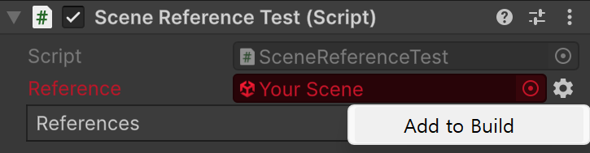

# Onion.SceneManagement

Unity scene management package with async loading, stable scene references, transition flows, and editor support.

## Requirements

- Unity 6.0 or newer
- Optional: Addressables package

## Quick Start

```csharp
using Onion.SceneManagement;
using Onion.SceneManagement.Transition;
```

```csharp
SceneReference _reference;
List<SceneReference> _scenes;

// by SceneReference (also supports name, build index, address)
await SceneManager.LoadSceneAsync(_reference); 

// with transition mode (Default, Additive, Refresh, ...)
await SceneManager.LoadSceneAsync(_reference, TransitionMode.Additive);

// extensions for IEnumerable<SceneReference>
await _scenes.LoadAsync();   
await _scenes.UnloadAsync();

```

```csharp
List<SceneReference> _scenes;
await Transition.Create(_scenes)
	.NotifyExit()
	.Unload()
	.Load()
	.NotifyEnter()
	.ExecuteAsync();
```

## Features

### Transition

- Create custom transition flows with fluent API
```csharp
await Transition.Create(scenesToLoad)
    .NotifyExit()
    .Unload()
    .WaitForSeconds(1f)
    .Load()
    .NotifyEnter()
    .Callback(() => Debug.Log("Enter complete"))
    .ExecuteAsync();
```

- Available built-in transition steps:
    - `Load`, `Unload` - scene loading/unloading with various options
    - `NotifyExit`, `NotifyEnter` - send messages to root objects in scenes
    - `Callback` - execute custom code during transition
    - `DelayFrame`, `NextFrame` - wait for specific frame events
    - `WaitForSeconds`, `WaitForFrames` - add delays between steps
    - `WaitWhile`, `WaitUntil` - wait for custom conditions
    - `WaitForEndOfFrame`, `WaitForFixedUpdate` - wait for specific Unity events

### SceneReference

- Stable scene references by GUID
- Inspector validation with quick build-setting fixes


## Notes

- `SceneReference` is based on the ideas from [Eflatun.SceneReference](https://github.com/starikcetin/Eflatun.SceneReference) by starikcetin.
- Package name: `com.onion.scenemanagement`.
